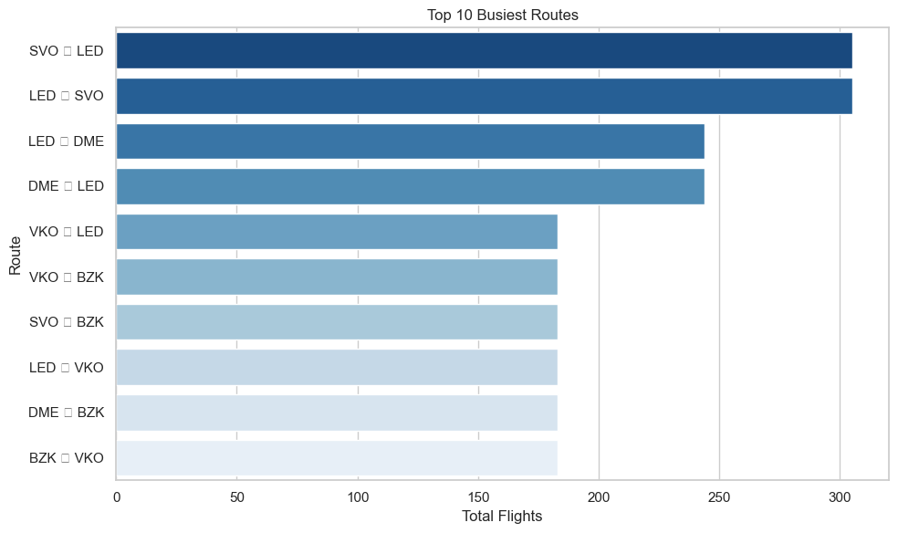
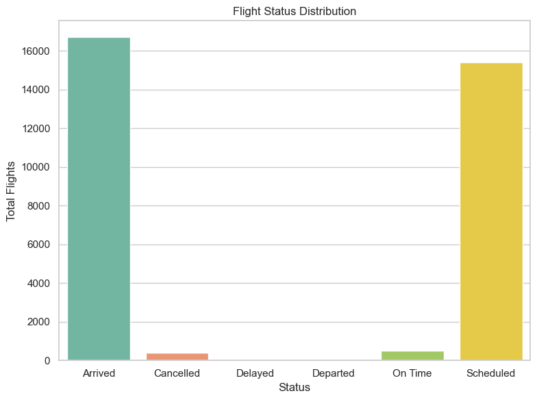
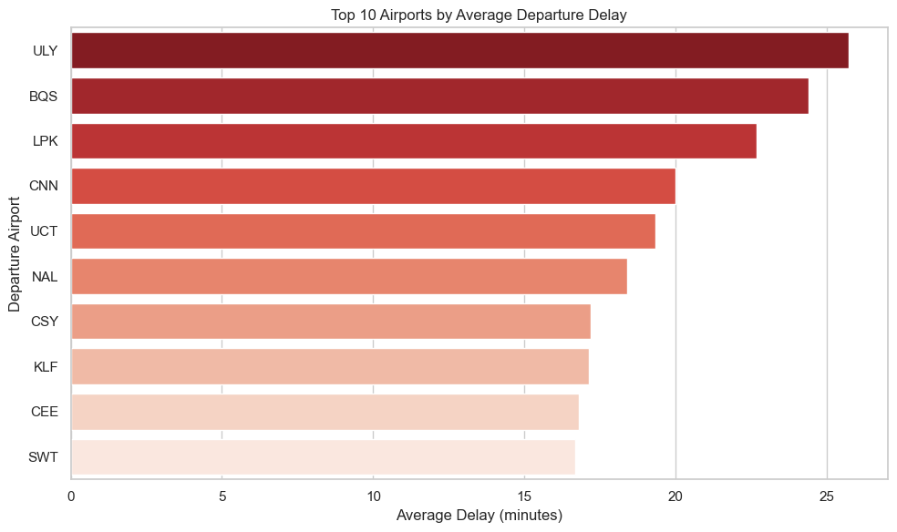
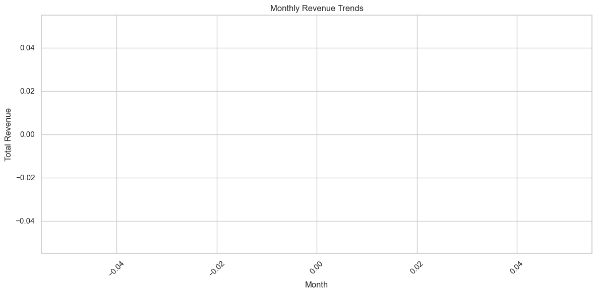
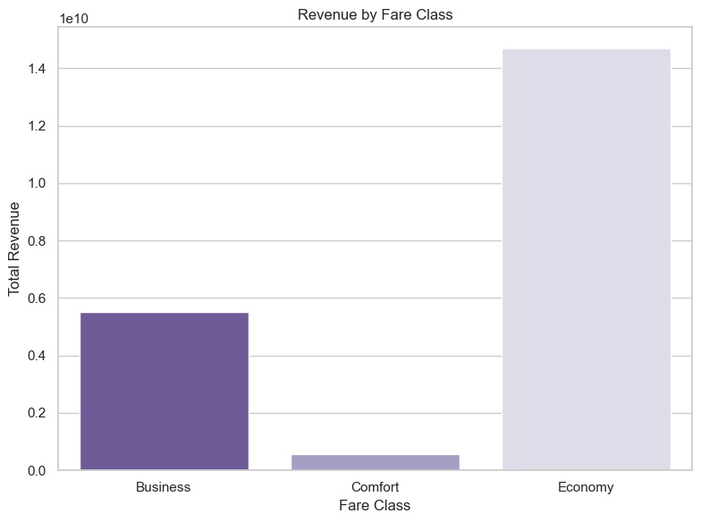

Top 10 Most Popular Routes


```python
import sqlite3
import pandas as pd

db_path = r'C:\Users\User\Downloads\Anaconda\Airlines Dataset (SQL)\travel.sqlite'
conn = sqlite3.connect(db_path)

query = """
SELECT 
    departure_airport || ' ➝ ' || arrival_airport AS route,
    COUNT(*) AS total_flights
FROM flights
GROUP BY route
ORDER BY total_flights DESC
LIMIT 10;

"""

df = pd.read_sql_query(query, conn)
print(df)

```

           route  total_flights
    0  SVO ➝ LED            305
    1  LED ➝ SVO            305
    2  LED ➝ DME            244
    3  DME ➝ LED            244
    4  VKO ➝ LED            183
    5  VKO ➝ BZK            183
    6  SVO ➝ BZK            183
    7  LED ➝ VKO            183
    8  DME ➝ BZK            183
    9  BZK ➝ VKO            183
    

Airports with the Most Departures


```python
import sqlite3
import pandas as pd

db_path = r'C:\Users\User\Downloads\Anaconda\Airlines Dataset (SQL)\travel.sqlite'
conn = sqlite3.connect(db_path)

query = """
SELECT 
    departure_airport,
    COUNT(*) AS departures
FROM flights
GROUP BY departure_airport
ORDER BY departures DESC
LIMIT 10;

"""

df = pd.read_sql_query(query, conn)
print(df)

```

      departure_airport  departures
    0               DME        3217
    1               SVO        2981
    2               LED        1900
    3               VKO        1719
    4               OVB        1055
    5               KJA         707
    6               SVX         689
    7               PEE         619
    8               ROV         617
    9               BZK         610
    

Average Delay per Airport (Departure)


```python
import sqlite3
import pandas as pd

db_path = r'C:\Users\User\Downloads\Anaconda\Airlines Dataset (SQL)\travel.sqlite'
conn = sqlite3.connect(db_path)

query = """
SELECT 
    departure_airport,
    ROUND(AVG(
        JULIANDAY(SUBSTR(actual_departure, 1, 19)) - 
        JULIANDAY(SUBSTR(scheduled_departure, 1, 19))
    ) * 24 * 60, 2) AS avg_delay_minutes
FROM flights
WHERE actual_departure IS NOT NULL
  AND scheduled_departure IS NOT NULL
  AND JULIANDAY(SUBSTR(actual_departure, 1, 19)) > JULIANDAY(SUBSTR(scheduled_departure, 1, 19))
GROUP BY departure_airport
HAVING avg_delay_minutes IS NOT NULL
ORDER BY avg_delay_minutes DESC
LIMIT 10;

"""

df = pd.read_sql_query(query, conn)
print(df)

```

      departure_airport  avg_delay_minutes
    0               ULY              25.73
    1               BQS              24.38
    2               LPK              22.68
    3               CNN              19.99
    4               UCT              19.33
    5               NAL              18.40
    6               CSY              17.18
    7               KLF              17.14
    8               CEE              16.79
    9               SWT              16.68
    

Revenue by Flight


```python
import sqlite3
import pandas as pd

db_path = r'C:\Users\User\Downloads\Anaconda\Airlines Dataset (SQL)\travel.sqlite'
conn = sqlite3.connect(db_path)

query = """
SELECT 
    f.flight_no,
    COUNT(tf.ticket_no) AS tickets_sold,
    SUM(tf.amount) AS total_revenue
FROM flights f
JOIN ticket_flights tf ON f.flight_id = tf.flight_id
GROUP BY f.flight_no
ORDER BY total_revenue DESC
LIMIT 10;

"""

df = pd.read_sql_query(query, conn)
print(df)

```

      flight_no  tickets_sold  total_revenue
    0    PG0208          9647      753478300
    1    PG0209          9366      733797800
    2    PG0222         15903      548218900
    3    PG0223         15402      531503700
    4    PG0357          6435      507672400
    5    PG0356          6331      498750700
    6    PG0277         13160      458130400
    7    PG0278         12837      446051200
    8    PG0198          6958      411603000
    9    PG0199          6801      404050300
    

Top Aircraft Models by Usage


```python
import sqlite3
import pandas as pd

db_path = r'C:\Users\User\Downloads\Anaconda\Airlines Dataset (SQL)\travel.sqlite'
conn = sqlite3.connect(db_path)

query = """
SELECT 
    ad.model,
    COUNT(f.flight_id) AS flights_count
FROM aircrafts_data ad
JOIN flights f ON ad.aircraft_code = f.aircraft_code
GROUP BY ad.model
ORDER BY flights_count DESC
LIMIT 10;

"""

df = pd.read_sql_query(query, conn)
print(df)

```

                                                   model  flights_count
    0  {"en": "Cessna 208 Caravan", "ru": "Сессна 208...           9273
    1  {"en": "Bombardier CRJ-200", "ru": "Бомбардье ...           9048
    2  {"en": "Sukhoi Superjet-100", "ru": "Сухой Суп...           8504
    3  {"en": "Airbus A321-200", "ru": "Аэробус A321-...           1952
    4    {"en": "Boeing 737-300", "ru": "Боинг 737-300"}           1274
    5  {"en": "Airbus A319-100", "ru": "Аэробус A319-...           1239
    6    {"en": "Boeing 767-300", "ru": "Боинг 767-300"}           1221
    7    {"en": "Boeing 777-300", "ru": "Боинг 777-300"}            610
    

Seat Occupancy Rate by Flight


```python
import sqlite3
import pandas as pd

db_path = r'C:\Users\User\Downloads\Anaconda\Airlines Dataset (SQL)\travel.sqlite'
conn = sqlite3.connect(db_path)

query = """
SELECT 
    f.flight_no,
    COUNT(DISTINCT bp.seat_no) * 1.0 / COUNT(DISTINCT s.seat_no) AS occupancy_rate
FROM flights f
JOIN boarding_passes bp ON f.flight_id = bp.flight_id
JOIN seats s ON f.aircraft_code = s.aircraft_code
GROUP BY f.flight_no
ORDER BY occupancy_rate DESC
LIMIT 10;

"""

df = pd.read_sql_query(query, conn)
print(df)

```

      flight_no  occupancy_rate
    0    PG0708             1.0
    1    PG0707             1.0
    2    PG0704             1.0
    3    PG0703             1.0
    4    PG0700             1.0
    5    PG0699             1.0
    6    PG0698             1.0
    7    PG0697             1.0
    8    PG0690             1.0
    9    PG0689             1.0
    

Fare Condition Distribution


```python
import sqlite3
import pandas as pd

db_path = r'C:\Users\User\Downloads\Anaconda\Airlines Dataset (SQL)\travel.sqlite'
conn = sqlite3.connect(db_path)

query = """
SELECT 
    fare_conditions,
    COUNT(*) AS ticket_count,
    ROUND(AVG(amount), 2) AS avg_price
FROM ticket_flights
GROUP BY fare_conditions;

"""

df = pd.read_sql_query(query, conn)
print(df)

```

      fare_conditions  ticket_count  avg_price
    0        Business        107642   51143.42
    1         Comfort         17291   32740.55
    2         Economy        920793   15959.81
    

Most Frequently Used Aircrafts


```python
import sqlite3
import pandas as pd

db_path = r'C:\Users\User\Downloads\Anaconda\Airlines Dataset (SQL)\travel.sqlite'
conn = sqlite3.connect(db_path)

query = """
SELECT 
    aircraft_code,
    COUNT(*) AS flights_count
FROM flights
GROUP BY aircraft_code
ORDER BY flights_count DESC
LIMIT 10;

"""

df = pd.read_sql_query(query, conn)
print(df)

```

      aircraft_code  flights_count
    0           CN1           9273
    1           CR2           9048
    2           SU9           8504
    3           321           1952
    4           733           1274
    5           319           1239
    6           763           1221
    7           773            610
    

Most Active Passengers (by number of flights)


```python
import sqlite3
import pandas as pd

db_path = r'C:\Users\User\Downloads\Anaconda\Airlines Dataset (SQL)\travel.sqlite'
conn = sqlite3.connect(db_path)

query = """
SELECT 
    t.passenger_id,
    COUNT(tf.flight_id) AS flights_taken
FROM tickets t
JOIN ticket_flights tf ON t.ticket_no = tf.ticket_no
GROUP BY t.passenger_id
ORDER BY flights_taken DESC
LIMIT 10;

"""

df = pd.read_sql_query(query, conn)
print(df)

```

      passenger_id  flights_taken
    0  9999 443424              6
    1  9997 789459              6
    2  9996 141818              6
    3  9995 635489              6
    4  9993 874168              6
    5  9993 619779              6
    6  9992 946711              6
    7  9992 261142              6
    8  9991 811162              6
    9  9990 198681              6
    

Top 10 Busiest Routes


```python
import sqlite3
import pandas as pd

db_path = r'C:\Users\User\Downloads\Anaconda\Airlines Dataset (SQL)\travel.sqlite'
conn = sqlite3.connect(db_path)

query = """
SELECT 
    departure_airport || ' ➝ ' || arrival_airport AS route,
    COUNT(*) AS total_flights
FROM flights
GROUP BY route
ORDER BY total_flights DESC
LIMIT 10;


"""

df = pd.read_sql_query(query, conn)
print(df)

```

           route  total_flights
    0  SVO ➝ LED            305
    1  LED ➝ SVO            305
    2  LED ➝ DME            244
    3  DME ➝ LED            244
    4  VKO ➝ LED            183
    5  VKO ➝ BZK            183
    6  SVO ➝ BZK            183
    7  LED ➝ VKO            183
    8  DME ➝ BZK            183
    9  BZK ➝ VKO            183
    


```python
import sqlite3
import pandas as pd
import matplotlib.pyplot as plt
import seaborn as sns
import warnings

warnings.filterwarnings("ignore")

sns.set(style="whitegrid")


conn = sqlite3.connect(r"C:\Users\User\Downloads\Anaconda\Airlines Dataset (SQL)\travel.sqlite")

# 1. Top 10 Busiest Routes
query1 = """
SELECT 
    departure_airport || ' ➝ ' || arrival_airport AS route,
    COUNT(*) AS total_flights
FROM flights
GROUP BY route
ORDER BY total_flights DESC
LIMIT 10;
"""
df1 = pd.read_sql_query(query1, conn)
plt.figure(figsize=(10, 6))
sns.barplot(x='total_flights', y='route', data=df1, palette='Blues_r')
plt.title('Top 10 Busiest Routes')
plt.xlabel('Total Flights')
plt.ylabel('Route')
plt.tight_layout()
plt.show()

# 2. Flight Status Distribution
query2 = """
SELECT 
    status,
    COUNT(*) AS total_flights
FROM flights
GROUP BY status;
"""
df2 = pd.read_sql_query(query2, conn)
plt.figure(figsize=(8, 6))
sns.barplot(x='status', y='total_flights', data=df2, palette='Set2')
plt.title('Flight Status Distribution')
plt.xlabel('Status')
plt.ylabel('Total Flights')
plt.tight_layout()
plt.show()

# 3. Average Delay per Airport (Top 10)
query3 = """
SELECT 
    departure_airport,
    ROUND(AVG(
        JULIANDAY(SUBSTR(actual_departure, 1, 19)) - 
        JULIANDAY(SUBSTR(scheduled_departure, 1, 19))
    ) * 24 * 60, 2) AS avg_delay_minutes
FROM flights
WHERE actual_departure IS NOT NULL
  AND scheduled_departure IS NOT NULL
  AND JULIANDAY(SUBSTR(actual_departure, 1, 19)) > JULIANDAY(SUBSTR(scheduled_departure, 1, 19))
GROUP BY departure_airport
HAVING avg_delay_minutes IS NOT NULL
ORDER BY avg_delay_minutes DESC
LIMIT 10;
"""
df3 = pd.read_sql_query(query3, conn)
plt.figure(figsize=(10, 6))
sns.barplot(x='avg_delay_minutes', y='departure_airport', data=df3, palette='Reds_r')
plt.title('Top 10 Airports by Average Departure Delay')
plt.xlabel('Average Delay (minutes)')
plt.ylabel('Departure Airport')
plt.tight_layout()
plt.show()

# 4. Monthly Revenue Trends
query4 = """
SELECT 
    STRFTIME('%Y-%m', book_date) AS booking_month,
    COUNT(*) AS total_bookings,
    SUM(total_amount) AS total_revenue
FROM bookings
GROUP BY booking_month
ORDER BY booking_month;
"""
df4 = pd.read_sql_query(query4, conn)
plt.figure(figsize=(12, 6))
sns.lineplot(x='booking_month', y='total_revenue', data=df4, marker='o')
plt.xticks(rotation=45)
plt.title('Monthly Revenue Trends')
plt.xlabel('Month')
plt.ylabel('Total Revenue')
plt.tight_layout()
plt.show()

# 5. Revenue by Fare Class
query5 = """
SELECT 
    fare_conditions,
    COUNT(*) AS tickets_sold,
    ROUND(SUM(amount), 2) AS total_revenue
FROM ticket_flights
GROUP BY fare_conditions;
"""
df5 = pd.read_sql_query(query5, conn)
plt.figure(figsize=(8, 6))
sns.barplot(x='fare_conditions', y='total_revenue', data=df5, palette='Purples_r')
plt.title('Revenue by Fare Class')
plt.xlabel('Fare Class')
plt.ylabel('Total Revenue')
plt.tight_layout()
plt.show()


conn.close()

```


    

    


    

    


    

    


    

    


    

    

